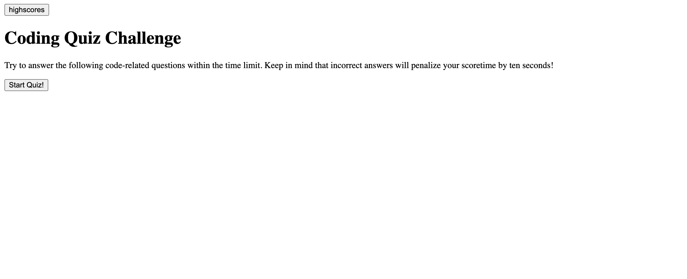
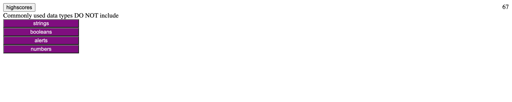
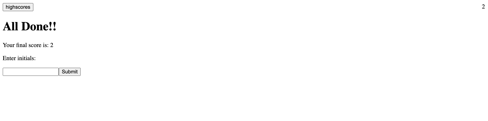

# NOTE TAKER README

## Description

The purpose of this project is to create an quiz application to test the user on basic code knowledge. The timer on the quiz will go down by 10 seconds every time the user answers the question wrong and once the timer reaches 0, a "Game Over" message appears and illustrates the users score. Creating this application introduced me to working with Web APIs and having a dynamically updated HTML and CSS powered by JavaScript code.

## Table of Contents

* [Acceptance Criteria](#criteria)
* [Usage](#usage)
* [Screenshot](#screenshot)

## User Story

AS A coding boot camp student
I WANT to take a timed quiz on JavaScript fundamentals that stores high scores
SO THAT I can gauge my progress compared to my peers

## Acceptance Criteria

GIVEN I am taking a code quiz
WHEN I click the start button
THEN a timer starts and I am presented with a question
WHEN I answer a question
THEN I am presented with another question
WHEN I answer a question incorrectly
THEN time is subtracted from the clock
WHEN all questions are answered or the timer reaches 0
THEN the game is over
WHEN the game is over
THEN I can save my initials and score

## Usage

In order to use this application the user must open up the browser, click on the button that's titled "Start Quiz" and this will populate the first multiple choice question. Once the user goes through answering all of the multiple choice questions or the time runs out, the user will be able to see their high-score and submit their score using their initials

## Screenshot
Starting Page:

Display of Questions:

Finished Quiz Display:

